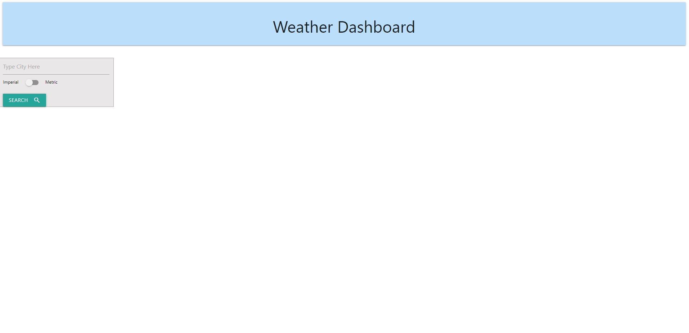
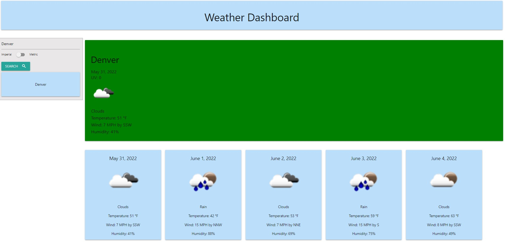
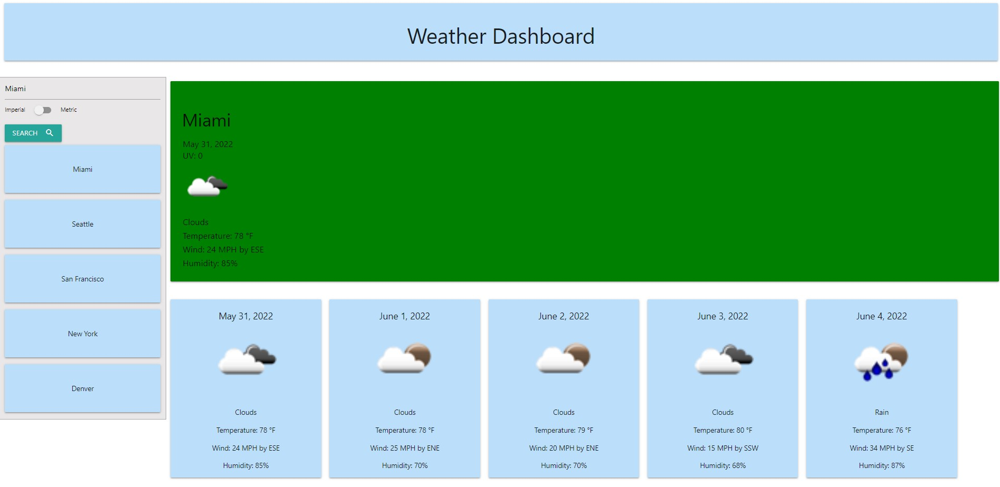
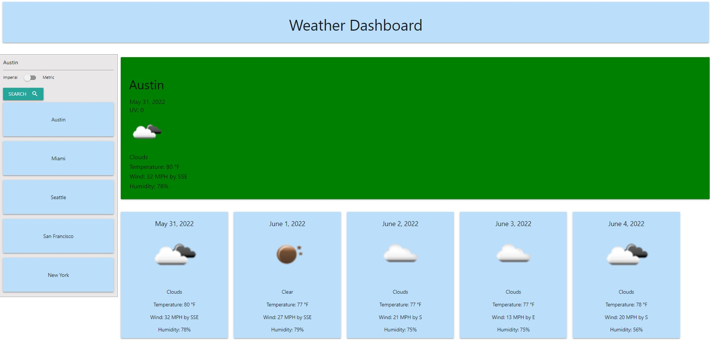

This is a weather dashboard app that uses the Free OpenWeather API.
Upon opening the link, the user is presented with an empty homepage. 
Any city in the US may be entered into the search bar and current weather information will populate the screen. The background of the main section will change depending on the current UV index. Below the main section, the 5 day forecast will populate.  
The users past 5 querys will populate below the search bar and be saved to local storage so searches can be placed by clicking the listed city. 
After five searches have been made, the user searching a sixth city will remove the oldest searched city to preserve the max of 5 past searches 

The link to the app is here: https://brisco13.github.io/WeatherPage/